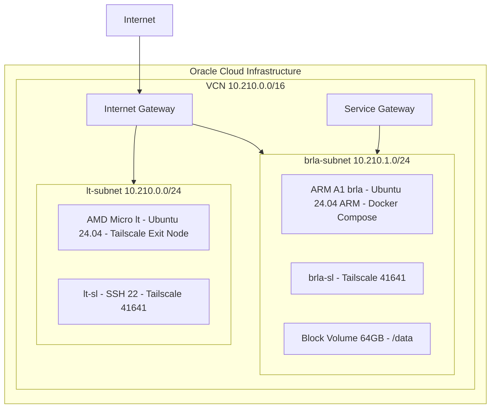

# CLAUDE.md

This file provides guidance to Claude Code (claude.ai/code) when working with code in this repository.

## Project Overview

OCI Free-Tier(AMD Micro + ARM A1) 인프라 구성 프로젝트. Web Browser만 접근 가능한 환경에서 OpenTofu + Ansible로 프로비저닝하고, Tailscale HTTPS로 서비스에 접근. OpenTofu로 Oracle Cloud 리소스를 관리하고, Ansible로 인스턴스 설정. SOPS(age)로 시크릿을 암호화한다. GitHub Codespaces에서 초기 프로비저닝 후 Tailscale HTTPS로 서비스에 접속한다.

## Prerequisites

- **도구**: `tofu` (OpenTofu), `sops`, `age` (암호화 키), `ansible`
- **키 파일**: 프로젝트 루트에 `keys.txt` (age 개인키, `.gitignore`에 등록됨)
- **환경**: Codespaces(`.devcontainer/`) 또는 로컬
- **R2 자격 증명**: Cloudflare R2의 Access Key ID / Secret Access Key (환경변수 `AWS_ACCESS_KEY_ID`, `AWS_SECRET_ACCESS_KEY` — `tofu init` 시 필요)

## Commands

```bash
# SOPS 시크릿 관리 (keys.txt 필요)
source .env.local          # enc/dec/load alias 로드
dec                        # .env.sops → .env 복호화
enc                        # .env → .env.sops 암호화
load                       # .env 변수를 쉘 환경에 주입

# OpenTofu (opentofu/ 디렉토리에서 실행)
cd opentofu
tofu init                  # Cloudflare R2 backend로 초기화
tofu plan -var-file=terraform.tfvars
tofu apply -auto-approve -var-file=terraform.tfvars

# Ansible (Tailscale 연결 시 실행)
cd opentofu
tofu output -raw ansible_inventory_ini > ../ansible/inventory/hosts.ini
cd ../ansible
ansible-playbook playbook-lt.yml       # AMD Micro(lt): exit node 설정
ansible-playbook playbook-brla.yml     # ARM A1(brla): Docker + 서비스 배포

# Ansible 운영 관리 (inventory 생성 후)
ansible-playbook playbook-ops.yml --tags reboot          # lt/brla 병렬 재부팅
ansible-playbook playbook-ops.yml --tags system-update   # apt 업데이트 (lt/brla)
ansible-playbook playbook-ops.yml --tags docker-update   # Docker 이미지 pull + 컨테이너 재시작 (brla)
ansible-playbook playbook-ops.yml --tags health          # health check (uptime, load, disk)

# Ansible 구문 검증 (적용 전, brla Tailscale 접속 불필요)
ansible-playbook --syntax-check ansible/playbook-brla.yml -i ansible/inventory/hosts.ini

# 전체 배포 (setup.sh)
bash setup.sh

# SSH 접속 (IP는 inventory에서 동적 획득)
LT_IP=$(grep 'ansible_host=' ansible/inventory/hosts.ini | head -1 | sed 's/.*ansible_host=\([^ ]*\).*/\1/')
BRLA_IP=$(grep 'ansible_host=' ansible/inventory/hosts.ini | tail -1 | sed 's/.*ansible_host=\([^ ]*\).*/\1/')
ssh ubuntu@$LT_IP                                                     # lt 직접
ssh -o ProxyJump=ubuntu@$LT_IP ubuntu@$BRLA_IP                        # brla (lt 경유)

# 서비스 검증 (brla에서 — 컨테이너는 127.0.0.1 바인딩)
curl -s -o /dev/null -w '%{http_code}' http://localhost:3000           # Homepage
curl -s -o /dev/null -w '%{http_code}' http://localhost:8080           # code-server
curl -s -o /dev/null -w '%{http_code}' http://localhost:8088           # Gatus
curl -s -o /dev/null -w '%{http_code}' http://localhost:8090           # Beszel
curl -s -o /dev/null -w '%{http_code}' http://localhost:9120           # Hermes dashboard (0.0.0.0 bind, basic_auth → 302)
curl -s -o /dev/null -w '%{http_code}' http://localhost:8642/health    # Hermes gateway (host 포트매핑)
curl -s -o /dev/null -w '%{http_code}' http://localhost:3001           # Patchmon (server, docker-compose)
curl -s -o /dev/null -w '%{http_code}' http://localhost:10001          # Pulse (모니터링, docker-compose)

# 외부 접근 (Tailscale Serve HTTPS — brla.bun-bull.ts.net)
curl -sk -o /dev/null -w '%{http_code}' https://brla.bun-bull.ts.net/          # Homepage (443)
curl -sk -o /dev/null -w '%{http_code}' https://brla.bun-bull.ts.net:8080/     # code-server
curl -sk -o /dev/null -w '%{http_code}' https://brla.bun-bull.ts.net:8088/     # Gatus
curl -sk -o /dev/null -w '%{http_code}' https://brla.bun-bull.ts.net:8090/     # Beszel
curl -sk -o /dev/null -w '%{http_code}' https://brla.bun-bull.ts.net:9119/login  # Hermes dashboard (basic_auth 로그인 폼; 루트 /도 #58166 패치로 /login 폴백)
curl -sk -o /dev/null -w '%{http_code}' https://brla.bun-bull.ts.net:8443/       # Patchmon
curl -sk -o /dev/null -w '%{http_code}' https://brla.bun-bull.ts.net:10000/      # Pulse

# 개발 도구 검증 (brla, code-server 터미널)
mise --version && node -v && pnpm -v                                  # mise + Node.js 24 + pnpm
sops --version && age --version                                       # 시크릿 암호화 도구
claude --version                                                      # Claude Code (인증은 별도)
```

## Architecture



- **Provisioning**: OpenTofu(cloud-init으로 Tailscale 설치) → Ansible(Tailscale 네트워크로 전체 설정)
- **Secret Flow**: `.env.sops`(암호화, git 추적) → `sops -d` → `.env`(평문, `.gitignore`) → `setup.sh`가 `terraform.tfvars`와 OCI PEM 키 자동 생성
- **SOPS binary 모드**: `.env`에 PEM 키, 멀티라인 값 등 특수문자가 포함되어 `--input-type binary`로 인코딩 문제를 우회함
- **State Backend**: Cloudflare R2 (S3-compatible). 버킷(`terraform-state`)은 수동 생성
- **Hostnames**: `lt`(L-T, 조명 로봇), `brla`(BRL-A, 파라솔 로봇) — WALL-E 세계관
- **HTTPS**: Tailscale Serve 포트 기반 HTTPS 종단 (인증서 `/var/lib/tailscale/certs/`, `*.bun-bull.ts.net`) — Homepage(443), code-server(8080), Gatus(8088), Beszel(8090), Hermes dashboard(9119→9120, basic_auth), Patchmon(8443→3001), Pulse(10000→10001)
- **Region**: OCI `ap-chuncheon-1` (춘천)

## Key Variables

`terraform.tfvars`에 필요한 변수 (`.env`에서 자동 주입):

| 변수 | 출처 |
| :--- | :--- |
| `oci_tenancy_ocid` | OCI 콘솔 |
| `oci_user_ocid` | OCI 콘솔 |
| `oci_fingerprint` | OCI API 키 |
| `oci_private_key_path` | `.env` → PEM 추출 |
| `compartment_ocid` | OCI 콘솔 |
| `oci_region` | 기본값 `ap-chuncheon-1` |
| `tailscale_auth_key` | Tailscale |
| `ssh_public_key` | 로컬 SSH 공개키 |

## Notes

- `setup.sh`가 실행 후 `.env`를 자동 삭제함 → Ansible 재실행 시 `sops -d` 재복호화 필요
- `setup.sh`에서 `tofu init`/`tofu plan`/`tofu apply` 자동 실행 (전체 프로비저닝)
- `.env.local`은 SOPS 유틸리티 (함수 + alias: `dec`, `enc`, `load`). `source .env.local`로 로드. `setup.sh`도 내부적으로 호출
- 인프라 변경 후 스펙과 실제 코드 동기화 필수
- Ansible role 분리 원칙: apt → `packages`, GitHub release 바이너리 → `binary`, 설정/서비스 → 개별 role. 새 도구는 설치 방식에 따라 배치

## Gotchas

- `.env.local`의 `dec`/`load`는 alias — Claude Code Bash(비대화형)에서 인식 안 됨. 직접 함수명 `sops-dec`, `sops-load` 또는 raw `sops -d` 명령 사용
- `.env.local` source 시 `SOPS_AGE_KEY_FILE="$(pwd)/keys.txt"` 강제 (사전 env override 무효) — age 키가 다른 경로(`~/.config/sops/age/keys.txt`)면 루트에 `keys.txt` 심볼릭 링크 필요
- **Ansible + SOPS 실행**: Claude Code Bash는 각 호출이 독립 셸 → `source .env`와 `ansible-playbook`을 반드시 **단일 명령**으로 실행해야 `lookup('env', ...)`가 SOPS 복호화 값을 인식함. 분리 실행 시 환경변수가 유실되어 `.env`에 빈 값 기록 → 컨테이너 미기동
- cloud-init(`user_data`) 변경 시 OCI 인스턴스 재생성(destroy+recreate) → **Public IP 변경**. cloud-init은 최소화(Tailscale 설치만)하고 설정은 Ansible로 처리
- `OCI_PRIVATE_KEY` 환경변수가 OCI Terraform provider와 충돌 → `tofu` 명령 전 `unset OCI_PRIVATE_KEY` 필수
- Tailscale cert DNS명에 trailing dot 포함 (`brla.bun-bull.ts.net.`) → `rstrip('.')` 처리
- Tailscale 인증서 경로는 `/var/lib/tailscale/certs/` (not `/etc/tailscale/`)
- Ansible inventory: brla 접속 시 lt를 ProxyJump로 사용 (`-o ProxyJump=ubuntu@<lt_ip>`) — 단, 이는 공인 IP/OCI 서브넷 라우팅용 tofu 생성 inventory 한정
- `ansible/inventory/hosts.ini`는 gitignored + `tofu output -raw ansible_inventory_ini`로 생성. tofu(R2+OCI) 없이 hermes-only 배포 시 최소 inventory(`[brla]` + `brla ansible_user=ubuntu`)로 동작 — brla는 Tailscale MagicDNS로 직접 SSH 가능
- code-server 컨테이너는 ubuntu UID 1001과 매칭 (`user: "1001:1001"`) → 호스트에서 파일 조작 가능 (sudo 불필요)
- brla 컨테이너 포트는 항상 `127.0.0.1:<port>:<port>`로 바인딩. `tailscale serve`가 Tailscale IP에서 HTTPS 종단 후 `127.0.0.1:<port>`로 프록시. `0.0.0.0:<port>`(또는 `<port>:<port>`) 바인딩 시 tailscaled가 점유한 Tailscale IP 포트와 충돌 (`address already in use`)
- Hermes 환경변수는 `env_file: /data/hermes/.env`로 주입 (Ansible `env.j2` 템플릿이 생성, host config — 컨테이너 볼륨 `/data/hermes/data/` 밖). docker-compose `environment:` 불필요
- Hermes 컨테이너는 UID 10000으로 `/data/hermes/data` 소유권 변경 → 호스트에서 파일 조작 시 `sudo` 필요
- Hermes 데이터 구조: `/data/hermes/data/` (실제 데이터, 디렉토리 마운트), `/data/hermes/docker-compose.yml` (Ansible 생성)
- Hermes API server: `API_SERVER_KEY`(16자+ 필수 — 현재 이미지에서 16자 미만 시 api_server 기동 거부, gateway 8642 미동작), Dashboard: `HERMES_DASHBOARD_HOST=0.0.0.0` + `HERMES_DASHBOARD_PORT=9120` + basic_auth (`HERMES_DASHBOARD_BASIC_AUTH_USERNAME`/`_PASSWORD`, SOPS 관리)
- Hermes AI: Tailscale Aperture 경유, base URL `http://ai`, provider `custom:aperture`, model `dola-seed-2.0-lite`, `api_mode: anthropic_messages`
- Hermes `network_mode: host` (`http://ai` Tailscale Aperture 접근 위해). Dashboard는 `HERMES_DASHBOARD_HOST=0.0.0.0` + `PORT=9120`로 bind — 2026-06 hardening으로 non-loopback bind 시 auth provider 필수(`HERMES_DASHBOARD_INSECURE`는 no-op) → basic_auth 설정. `0.0.0.0` wildcard라 Host 검증 통과. tailscale serve `:9119 → http://127.0.0.1:9120` 프록시(HTTPS 종단). 접근: `https://brla.bun-bull.ts.net:9119` (basic_auth form 로그인)
- Hermes dashboard serve 외부 포트(9119)는 bind 포트(9120)와 **달라야 함** — hermes가 `0.0.0.0:9120`을 잡으면 tailscaled의 Tailscale IP:9120과 충돌 (`address already in use`). 같은 포트(9120/9120)를 쓰려면 hermes를 127.0.0.1로 해야 하나, 그럼 외부 hostname Host가 거부됨(400)
- Hermes dashboard Host 검증은 bind 주소에 **hardcoded (allowlist config 없음)** — `0.0.0.0`=모든 Host 허용, `127.0.0.1`=loopback Host만. 외부 hostname 접속엔 `0.0.0.0` 강제 (`--allowed-hosts` flag는 PR #37119 미출시, #34390 참조)
- Hermes dashboard 미인증 `/` → 302 → **500** (Hermes 버그 #58166: basic-auth-only + non-loopback bind 시 auto-SSO redirect가 `/auth/login?provider=basic`으로 빠져 `NotImplementedError`). **hermes role이 `files/patch_hermes_58166.py`로 `_auto_sso_response`에서 basic provider skip 패치 → `/`가 `/login`으로 폴백(200)**. 컨테이너 재생성 시마다 task가 재적용(영속). #58166 머지/릴리스(fix 포함 이미지) 시 패치 파일 + task 제거
- Hermes gateway(8642)는 Hermes 프로세스가 `127.0.0.1`에 직접 bind (health check용)
- Hermes role 실행 전 반드시 SOPS 복호화 + `.env` 로드 필요: `export SOPS_AGE_KEY_FILE=keys.txt && source .env`. 누락 시 `lookup('env', ...)`가 빈값 반환 → compose에 secret 누락 → gateway 미기동
- Hermes config: `_config_version: 26` 필수 (없으면 자동 마이그레이션으로 `key_env` 누락됨). `providers: {}` + `custom_providers` legacy 포맷 사용
- Hermes SSH: 컨테이너가 호스트의 `/data/hermes/ssh`(UID 10000, data 밖 — secret 분리)를 `/opt/data/home/.ssh`로 마운트하여 다른 Tailscale 호스트(axiom, eve, walle, lt, brla 등)에 SSH 접속. `ssh_config.j2`는 호스트 `/home/ubuntu/.ssh/config`에 배포, key는 Ansible이 `/data/hermes/ssh`로 복사(chown 10000). 기존 `/home/ubuntu/.ssh` 마운트는 UID 불일치로 제거
- Hermes Docker 볼륨: `/data/hermes/data:/opt/data` + `/data/hermes/ssh:/opt/data/home/.ssh` (디렉토리 마운트, rw, 오버레이). 컨테이너 `user: "10000:10000"` 고정 → 파일 owner 변질 없음
- Hermes Git 백업: `deuxksy/ai-brla` repo에 **일 1회** (03:10) 자동 백업. 호스트 root cron이 `flock -n /data/hermes/backup.lock docker exec hermes /opt/data/backup.sh` 실행 (컨테이너 UID 10000). SQLite online backup API → `gzip -9n` (state.db.sql.gz ≈ 39MB, GitHub 100MB 이하). `GITHUB_HERMES_TOKEN` env (docker-compose 주입, push 시점 transient). remote는 clean URL (`.git/config` token 잔존 없음). 복원: clone → `gunzip sql/*.sql.gz` → `python3 sqlite3 import`. 기존 4회/일 호스트 실행에서 전환 (`.git` 재초기화 + force push, archive tag 보존)
- SSH IdentitiesOnly: 글로벌 `IdentitiesOnly yes` + `IdentityFile ~/.ssh/id_ed25519` + `IdentityFile ~/.ssh/AI/id_ed25519` 로 해결. 별도 `ansible/ssh_config` 불필요
- Docker 로그 로테이션: `/etc/docker/daemon.json`으로 `max-size: 10m`, `max-file: 3`. **신규 컨테이너에만 적용** — 기존 컨테이너는 `docker compose down && up`으로 재생성 필요
- Docker data-root 이동 (Block Volume 활용): daemon.json `data-root=/data/docker` + containerd `config.toml` `root=/data/containerd`. 루트 볼륨(48G) 부담을 Block Volume(64G)으로 분리. systemd drop-in `RequiresMountsFor=/data`(`docker.service.d`/`containerd.service.d`)로 부팅 시 /data 마운트 후 데몬 시작 보장
- **containerd image store (Docker 29+ default)**: 이미지/레이어 데이터가 `/var/lib/docker`가 아닌 **`/var/lib/containerd`**에 저장됨. data-root만 `/data/docker`로 바꾸면 이미지 누락 → containerd root도 `/data/containerd`로 함께 이동 필수. docker role(tasks/main.yml)이 /data 마운트 → 디렉토리 생성 → containerd config → daemon.json 순서로 배치
- IP forwarding: cloud-init에서 제거, Ansible tailscale role에서만 설정. `tofu apply` 직후 Ansible을 즉시 실행해야 exit node 정상 동작
- zsh: ubuntu 기본 셸. code-server 터미널도 로그인 셸(zsh)을 따름
- sops: `binary` role에서 GitHub release 바이너리 (`/usr/local/bin/sops`) 설치. 최신 유지 시 `--extra-vars sops_force=true`
- sops binary 형식: `secrets/.env.sops`는 binary store(전체 평문을 단일 `data` ENC 블롭으로 암호화). `.env.local`의 `sops-dec`/`sops-enc`가 `--input-type binary --output-type binary`로 동작하므로 포맷 일치. 암호화 시 `.sops.yaml` path_regex(`^secrets/`) 매칭으로 age 키 자동 적용 (binary store는 self-describing이라 auto-detect도 정상 동작)
- SOPS .env.sops 값 편집 (추가/수정): 복호화 → 편집 → 재암호화 시 임시 평문 파일을 **반드시 `secrets/` 안**에 두어야 path_regex 매칭 (`/tmp/`면 "no matching creation rules found"). 기존 키는 `export KEY="value"` 형식이라 sed 교체 시 `^KEY=`가 아닌 `KEY=.*` 패턴 사용 (줄 시작이 `export `)
- code-server 비밀번호: `CODE_SERVER_PASSWORD` (SOPS `.env.sops` 관리). docker-compose template가 `lookup('env', 'CODE_SERVER_PASSWORD')`로 주입, 기본 `changeme` fallback
- packages: apt 패키지 모음 (age 등). 새 apt 도구는 이 role의 name 리스트에 추가
- binary: GitHub release 바이너리 모음 (sops 등). 새 바이너리 도구는 이 role에 추가
- mise: 사용자 범위 (`/home/ubuntu/.local/bin/mise`). Ansible은 non-login shell이라 `mise activate` 미동작 → role 내 모든 명령을 절대 경로로 호출, interactive shell용 활성화는 `.bashrc`/`.zshrc`에 별도 추가
- Claude Code: native installer (`~/.local/bin/claude`, Node 불필요). 인증은 대화형 OAuth → ansible 범위 밖, code-server 터미널에서 `claude` 실행 후 사용자 직접 인증
- Homepage 설정은 BRL-A 전용으로 재구성됨 (Hermes, code-server 위젯). Gatus endpoint 설정은 heritage 참조
- Gatus/Beszel 런타임 데이터는 이전하지 않음. `/data/gatus/data`, `/data/beszel/data`, `/data/beszel/socket`에서 신규 시작
- Patchmon/Pulse: `/data/patchmon/`, `/data/pulse/`에 배포 (docker-compose). Docker named volume(`patchmon_postgres_data`, `patchmon_redis_data`, `pulse_pulse_data`) 사용 → 데이터는 `/data/docker/volumes/`에 저장 (Block Volume). compose `name:` 명시로 컨테이너 재생성/위치 이동 시에도 같은 volume 재사용 (데이터 보존)
- Patchmon .env: SOPS `PATCHMON_` 접두어 13개 키 관리. `env.j2`가 `lookup('env', 'PATCHMON_*')`로 .env 생성 (최초 1회). pulse는 env_file 없이 compose `environment:`로 직접 설정 (비밀값 없음)
- 라우팅: Tailscale Serve 포트 기반 — Homepage(443→3000), code-server(8080), Gatus(8088), Beszel(8090), Hermes dashboard(9119→9120, basic_auth), Patchmon(8443→3001), Pulse(10000→10001)
- Docker `proxy` 네트워크는 컨테이너 간 통신용 (Tailscale Serve는 호스트 `127.0.0.1` 포트로 라우팅)
- 새 Beszel 계정은 SOPS의 `HOMEPAGE_VAR_BESZEL_USERNAME`/`HOMEPAGE_VAR_BESZEL_PASSWORD`와 일치해야 Homepage 위젯이 동작
- 라우팅은 Tailscale Serve가 담당. 매 배포 시 `tailscale serve reset` 후 각 포트 재등록 (tailscale role)
- Tailscale 인증서 발급(`tailscale cert`)은 유지 — Tailscale Serve가 TLS termination에 사용
- Homepage `HOMEPAGE_ALLOWED_HOSTS`: 도메인만 지정 (예: `brla.bun-bull.ts.net`). 포트 번호 불필요
- Homepage Calendar/Agenda 위젯: `view: agenda`에서도 `integrations:`에 ical URL을 명시해야 이벤트 표시됨. 빈 `integrations:`는 동작 안 함
- `playbook-hermes-only.yml`은 gitshare 그룹(GID 10001)과 `/data/git` 디렉토리 자동 생성 fallback을 포함 — docker role을 거치지 않고 hermes role만 단독 실행해도 gitshare 그룹이 없으면 pre_tasks에서 생성. `/data/git` 디렉토리 자체는 hermes role이 `git init --shared=group` 시 자동 생성
- Ansible ad-hoc 명령 실행 시 inventory 경로 명시 필수: `ansible -i ansible/inventory/hosts.ini brla ...`. 프로젝트 루트에서 실행하면 auto-discovery 안 됨
- `playbook-brla.yml` role은 tag 미부여 → `--tags <role>` 선택 실행 불가 (조용히 no-op). Hermes 단독은 `playbook-hermes-only.yml` 사용
- 결합점 (다중 파일 참조 값, 변경 시 동기화 필수):
  - **디바이스/볼륨**: `/dev/oracleoci/oraclevdb` (storage.tf, docker role), Docker data-root `/data/docker` + containerd root `/data/containerd` (docker role daemon.json/config.toml, systemd drop-in)
  - **서비스 포트** (compose 127.0.0.1 바인딩, tailscale serve — 내부/외부): homepage `3000`/`443`, code-server `8080`, gatus `8088`, beszel `8090`, hermes dashboard `9120`/`9119`, gateway `8642`(host 모드, Hermes 프로세스가 `0.0.0.0:9120` + `127.0.0.1:8642` 직접 bind), patchmon `3001`/`8443`, pulse `10001`/`10000`
  - **Docker 이미지명**: compose 파일, `playbook-ops.yml` docker-update tag
  - **호스트명/CIDR**: `lt`/`brla` (variables.tf, cloud-init, playbook), `10.210.1.0/24` (variables.tf, cloud-init, playbook)
  - **UID/GID**: `1001`(code-server)/`10000`(hermes) (compose, tasks), `10001`/gitshare 그룹 (docker role group task, code-server/hermes role user task)
  - **공유 디렉토리**: `/data/git` setgid `2775` — POSIX ACL 미사용, gitshare 보조 그룹으로 두 UID rw (docker role file task, code-server/hermes role groups); 호스트 유저 `coder`(UID 1001)/`hermes`(UID 10000) 시스템 등록 + gitshare 보조 그룹 부여 — 컨테이너 UID와 동일 (code-server/hermes role user task); `/data/git/.git` 소유권 `ubuntu:gitshare` 정규화 (hermes role `file` task, `git init --shared=group` 직후 — root 소유권을 recurse chown)
  - **Tailscale**: `41641/UDP` (vcn.tf Security List)

## Directory Structure

```
opentofu/                # OpenTofu
├── backend.tf           # Cloudflare R2 state backend
├── provider.tf          # OCI provider
├── variables.tf         # 변수 선언
├── data.tf              # Ubuntu 24.04 이미지 조회 (AMD/ARM)
├── vcn.tf               # VCN, Subnets, Security Lists, Gateway
├── compute.tf           # AMD Micro (lt) + ARM A1 (brla)
├── storage.tf           # Block Volume 64GB + Attachment
├── outputs.tf           # Ansible inventory, output values
├── cloud-init-lt.yaml   # lt: Tailscale + exit node
└── cloud-init-brla.yaml # brla: Tailscale

ansible/                 # Ansible
├── ansible.cfg
├── inventory/hosts.ini  # tofu output으로 자동 생성
├── playbook-lt.yml      # lt: Tailscale exit node
├── playbook-brla.yml    # brla: Docker + packages + binary + zsh + mise + claude-code + code-server + homepage + gatus + beszel + Hermes + patchmon + pulse
├── playbook-hermes-only.yml # brla: Hermes 단독 배포 (/data 마운트 검증 + gitshare fallback + hermes role만 실행)
├── playbook-ops.yml     # 운영 관리 (reboot, update, health check)
└── roles/
    ├── tailscale/       # exit node, IP forwarding, HTTPS cert 발급, Serve 포트 기반 라우팅
    ├── docker/          # Docker Engine + Compose, /data 마운트, data-root=/data/docker + containerd root=/data/containerd, systemd drop-in RequiresMountsFor=/data
    ├── packages/        # apt 패키지 모음 (age 등)
    ├── binary/          # GitHub release 바이너리 모음 (sops 등)
    ├── zsh/             # zsh + oh-my-zsh + ubuntu 기본 셸 전환
    ├── mise/            # mise (공식 installer) + Node.js LTS 24 + pnpm (corepack)
    ├── claude-code/     # Claude Code CLI (native installer, Node 불필요)
    ├── code-server/     # codercom/code-server:latest (user 1001:1001)
    ├── homepage/        # BRL-A 전용 Homepage 설정 (Info, Monitoring, AI, Development)
    ├── gatus/           # Heritage endpoint 설정 복사본, 신규 이력 DB
    ├── beszel/          # 신규 Beszel Hub (container_name: beszel-hub)
    ├── patchmon/        # ghcr.io/patchmon/patchmon-server:latest + postgres + redis (docker-compose, named volume)
    ├── pulse/           # rcourtman/pulse:latest (docker-compose, named volume)
    └── hermes/          # nousresearch/hermes-agent:latest, gateway run (network_mode: host)
        ├── files/gitignore          # 백업 제외 규칙
        ├── files/patch_hermes_58166.py  # #58166 우회 패치 (basic provider auto-SSO skip → /login 폴백)
        ├── templates/backup.sh.j2   # Git 백업 스크립트 (cron 실행)
        ├── templates/config.yaml.j2 # Hermes AI provider/model 설정 (Aperture, dola-seed-2.0-lite)
        ├── templates/docker-compose.yml.j2  # Ansible 생성
        ├── templates/env.j2         # Hermes 환경변수
        ├── templates/sgptrc.j2      # shell-gpt 설정
        └── templates/ssh_config.j2  # 호스트 SSH config (Tailscale 호스트 접속용)

.claude/settings.json   # Claude Code hook — ansible YAML/tofu .tf 편집 시 syntax-check/fmt 자동 실행
.claude/skills/          # Claude Code 스킬
├── deploy-infra/SKILL.md       # 전체 배포 파이프라인
├── tailscale-serve-sync/SKILL.md # Tailscale Serve 라우팅 동기화
├── update-service/SKILL.md     # 개별 서비스 업데이트
├── add-ansible-role/SKILL.md   # role 추가 워크플로우 (설치 방식별 배치)
├── cross-verify/SKILL.md       # 교차 검증 (Ansible syntax-check + tofu fmt)
├── docker-maintenance/SKILL.md # Docker 정리 (prune, 볼륨 조회)
└── verify-infra/SKILL.md       # 인프라 상태 검증

.claude/agents/          # Claude Code 서브에이전트
├── ansible-role-reviewer.md  # role 변경사항 품질 검증 (멱등성, become_user, non-login shell)
├── infra-reviewer.md         # 인프라 관점 리뷰 (보안/비용/가용성)
└── tofu-plan-reviewer.md     # tofu plan 파괴적 변경 감지 (재생성, IP 변경, 리소스 삭제)
```
