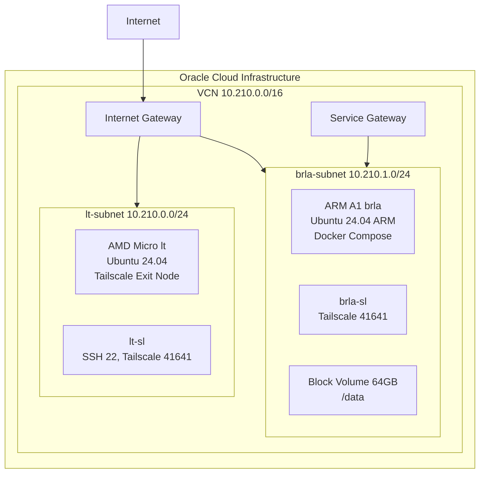

# CLAUDE.md

This file provides guidance to Claude Code (claude.ai/code) when working with code in this repository.

## Project Overview

OCI Free-Tier(AMD Micro + ARM A1) 인프라 구성 프로젝트. Web Browser만 접근 가능한 환경에서 OpenTofu + Ansible로 프로비저닝하고, Tailscale HTTPS로 code-server에 접속해 개발. OpenTofu로 Oracle Cloud 리소스를 관리하고, Ansible로 인스턴스 설정. SOPS(age)로 시크릿을 암호화한다. GitHub Codespaces에서 초기 프로비저닝 후 Tailscale HTTPS로 code-server에 접속한다.

## Prerequisites

- **도구**: `tofu` (OpenTofu), `sops`, `age` (암호화 키), `ansible`
- **키 파일**: 프로젝트 루트에 `keys.txt` (age 개인키, `.gitignore`에 등록됨)
- **환경**: Codespaces(`.devcontainer/`) 또는 로컬
- **R2 자격 증명**: Cloudflare R2의 Access Key ID / Secret Access Key (환경변수 `AWS_ACCESS_KEY_ID`, `AWS_SECRET_ACCESS_KEY` — `tofu init` 시 필요)

## Commands

```bash
# SOPS 시크릿 관리 (keys.txt 필요)
source .env.local          # enc/dec/load alias 로드
dec                        # .env.sops → .env 복호화
enc                        # .env → .env.sops 암호화
load                       # .env 변수를 쉘 환경에 주입

# OpenTofu (opentofu/ 디렉토리에서 실행)
cd opentofu
tofu init                  # Cloudflare R2 backend로 초기화
tofu plan -var-file=terraform.tfvars
tofu apply -auto-approve -var-file=terraform.tfvars

# Ansible (Tailscale 연결결 실행)
cd opentofu
tofu output -raw ansible_inventory_ini > ../ansible/inventory/hosts.ini
cd ../ansible
ansible-playbook playbook-lt.yml       # AMD Micro(lt): exit node 설정
ansible-playbook playbook-brla.yml     # ARM A1(brla): Docker + 서비스 배포

# Ansible 운영 관리 (inventory 생성 후)
ansible-playbook playbook-ops.yml --tags reboot          # lt/brla 병렬 재부팅
ansible-playbook playbook-ops.yml --tags system-update   # apt 업데이트 (lt/brla)
ansible-playbook playbook-ops.yml --tags docker-update   # Docker 이미지 pull + 컨테이너 재시작 (brla)
ansible-playbook playbook-ops.yml --tags health          # health check (uptime, load, disk)

# 전체 배포 (setup.sh)
bash setup.sh

# SSH 접속
ssh ubuntu@193.123.246.91                                              # lt 직접
ssh -o ProxyJump=ubuntu@193.123.246.91 ubuntu@100.99.163.97            # brla (lt 경유)

# 서비스 검증 (brla에서)
curl -s -o /dev/null -w '%{http_code}' http://localhost:8080           # code-server
curl -s -o /dev/null -w '%{http_code}' http://localhost:8642/health    # Hermes gateway
curl -s -o /dev/null -w '%{http_code}' http://localhost:9119           # Hermes dashboard
```

## Architecture



- **Provisioning**: OpenTofu(cloud-init으로 Tailscale 설치) → Ansible(Tailscale 네트워크로 전체 설정)
- **Secret Flow**: `.env.sops`(암호화, git 추적) → `sops -d` → `.env`(평문, `.gitignore`) → `setup.sh`가 `terraform.tfvars`와 OCI PEM 키 자동 생성
- **SOPS binary 모드**: `.env`에 PEM 키, 멀티라인 값 등 특수문자가 포함되어 `--input-type binary`로 인코딩 문제를 우회함
- **State Backend**: Cloudflare R2 (S3-compatible). 버킷(`terraform-state`)은 수동 생성
- **Hostnames**: `lt`(L-T, 조명 로봇), `brla`(BRL-A, 파라솔 로봇) — WALL-E 세계관
- **HTTPS**: Tailscale 내장 HTTPS (`*.bun-bull.ts.net`)
- **Region**: OCI `ap-chuncheon-1` (춘천)

## Key Variables

`terraform.tfvars`에 필요한 변수 (`.env`에서 자동 주입):

| 변수 | 출처 |
| :--- | :--- |
| `oci_tenancy_ocid` | OCI 콘솔 |
| `oci_user_ocid` | OCI 콘솔 |
| `oci_fingerprint` | OCI API 키 |
| `oci_private_key_path` | `.env` → PEM 추출 |
| `compartment_ocid` | OCI 콘솔 |
| `oci_region` | 기본값 `ap-chuncheon-1` |
| `tailscale_auth_key` | Tailscale |
| `ssh_public_key` | 로컬 SSH 공개키 |

## Notes

- `setup.sh`의 `rm -f .env` 라인이 현재 주석 처리됨 (보안상 활성화 권장)
- `setup.sh`에서 `tofu init`/`tofu plan`/`tofu apply` 자동 실행 (전체 프로비저닝)
- `.env.local`은 SOPS 유틸리티 (함수 + alias: `dec`, `enc`, `load`). `source .env.local`로 로드. `setup.sh`도 내부적으로 호출
- 인프라 변경 후 `docs/superpowers/specs/` 스펙과 실제 코드 동기화 필수

## Gotchas

- `OCI_PRIVATE_KEY` 환경변수가 OCI Terraform provider와 충돌 → `tofu` 명령 전 `unset OCI_PRIVATE_KEY` 필수
- Tailscale cert DNS명에 trailing dot 포함 (`brla.bun-bull.ts.net.`) → `rstrip('.')` 처리
- Tailscale 인증서 경로는 `/var/lib/tailscale/certs/` (not `/etc/tailscale/`)
- Ansible inventory: brla 접속 시 lt를 ProxyJump로 사용 (`-o ProxyJump=ubuntu@<lt_ip>`)
- code-server 컨테이너는 ubuntu UID 1001과 매칭 (`user: "1001:1001"`) → 호스트에서 파일 조작 가능 (sudo 불필요)
- Hermes API 키/토큰은 docker-compose `environment:`에서 Ansible로 직접 주입 (별도 `.env` 파일 사전 작성 불필요)
- Hermes 컨테이너는 UID 10000으로 `/data/hermes/data` 소유권 변경 → 호스트에서 파일 조작 시 `sudo` 필요
- Hermes 데이터 구조: `/data/hermes/data/` (실제 데이터, 디렉토리 마운트), `/data/hermes/docker-compose.yml` (Ansible 생성)
- Hermes API server: `API_SERVER_KEY`(8자+) 필수, Dashboard: `HERMES_DASHBOARD_INSECURE=1` (Tailscale 내부망)
- Hermes AI: Ark Coding Plan provider, base URL `https://ark.ap-southeast.bytepluses.com/api/coding/v1`, model `ark-code-latest`
- Hermes Docker 볼륨: `/data/hermes/data:/opt/data` (디렉토리 마운트, rw). 파일 단위 `:ro` 마운트 시 atomic write 불가

## Directory Structure

```
opentofu/                # OpenTofu
├── backend.tf           # Cloudflare R2 state backend
├── provider.tf          # OCI provider
├── variables.tf         # 변수 선언
├── data.tf              # Ubuntu 24.04 이미지 조회 (AMD/ARM)
├── vcn.tf               # VCN, Subnets, Security Lists, Gateway
├── compute.tf           # AMD Micro (lt) + ARM A1 (brla)
├── storage.tf           # Block Volume 64GB + Attachment
├── outputs.tf           # Ansible inventory, output values
├── cloud-init-lt.yaml   # lt: Tailscale + exit node
└── cloud-init-brla.yaml # brla: Tailscale

ansible/                 # Ansible
├── ansible.cfg
├── inventory/hosts.ini  # tofu output으로 자동 생성
├── playbook-lt.yml      # lt: Tailscale exit node
├── playbook-brla.yml    # brla: Docker + code-server + Hermes
├── playbook-ops.yml     # 운영 관리 (reboot, update, health check)
└── roles/
    ├── tailscale/       # exit node, IP forwarding, HTTPS cert
    ├── docker/          # Docker Engine + Compose, /data 마운트
    ├── code-server/     # codercom/code-server:latest (user 1000:1000)
    └── hermes/          # nousresearch/hermes-agent:latest, gateway run
        ├── data/          # 컨테이너 볼륨 (실제 데이터)
        └── docker-compose.yml  # Ansible 생성
```
