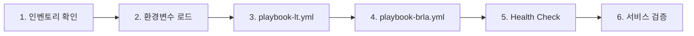

# Ansible 재적용 — 최신 코드 반영 + 배포 검증

> **Date**: 2026-06-04
> **Status**: Completed
> **Scope**: 기존 인프라에 Ansible Playbook 재실행하여 최신 설정 반영

## 배경

최근 커밋에서 Hermes AI 에이전트 설정, Discord 연동, Docker 볼륨 구조 등 다수 변경.
로컬 코드와 실제 인프라(OCI) 간 동기화 필요.

## 전략

**Ansible 재적용** — OpenTofu 리소스(VCN, Instance, Volume)는 유지하고 Ansible 설정만 재실행.
데이터 유실 없이 최신 설정 반영.

## 배포 순서



### Phase 1: 인벤토리 확인

```bash
cat ansible/inventory/hosts.ini  # 기존 inventory 유효성 확인
```

### Phase 2: 환경변수 로드

Ansible template에서 `lookup('env', ...)`로 환경변수를 참조하므로 사전 로드 필수.

```bash
source .env.local
sops-dec
sops-load
```

필요 환경변수:
- `HERMES_API_SERVER_KEY` — Hermes API 서버 인증
- `DISCORD_BOT_TOKEN` — Discord 봇 연동
- `DISCORD_ALLOWED_USERS` — Discord 허용 사용자
- `ANTHROPIC_API_KEY` — Ark Coding Plan API 키
- `ANTHROPIC_API_BASE` — Ark Coding Plan API 엔드포인트

### Phase 3: lt 구성 재적용

```bash
cd ansible
ansible-playbook playbook-lt.yml
```

반영 사항:
- Tailscale exit node 설정
- IP 포워딩 활성화

### Phase 4: brla 구성 재적용

```bash
ansible-playbook playbook-brla.yml
```

반영되는 최신 변경사항 (최근 커밋):
- Hermes Docker 볼륨 디렉토리 마운트 통합 (`/data/hermes/data:/opt/data`)
- Discord 채널 대화 활성화 (`free_response_channels`)
- Hermes API 서버 활성화 (`API_SERVER_KEY`)
- Hermes config.yaml 경로 수정 (`.hermes/` → `data/`)
- Ark Coding Plan provider 연결 (custom provider 설정)
- code-server 볼륨 분리 (`/data/code-server/data:/home/coder`)

### Phase 5: Health Check

```bash
ansible-playbook playbook-ops.yml --tags health
```

### Phase 6: 서비스 검증

```bash
# brla에서 직접 실행 (ssh brla 또는 Tailscale HTTPS 경유)
ssh brla 'curl -s -o /dev/null -w "%{http_code}" http://localhost:8080'        # code-server (302 = 정상)
ssh brla 'curl -s -o /dev/null -w "%{http_code}" http://localhost:8642/health'  # Hermes gateway (200)
ssh brla 'curl -s -o /dev/null -w "%{http_code}" http://localhost:9119'         # Hermes dashboard (200)
```

## 주의사항

- Tailscale serve는 멱등성 보장 안됨 — 재실행 시 `tailscale serve` 명령 재실행됨
- Hermes `.env`는 `when: not hermes_env.stat.exists` 조건 — 기존 파일 있으면 덮어쓰지 않음
- Hermes `config.yaml`은 항상 재생성 (template 모듈)

## Phase 2: Hermes 데이터 Git 백업 (배포 성공 후)

Ansible 재적용이 성공하면, Hermes 런타임 데이터를 `git@github.com:deuxksy/ai-brla.git`에 백업.

### 백업 대상

| 데이터 | 경로 | 설명 |
|:---|:---|:---|
| SOUL.md | `/data/hermes/data/SOUL.md` | Hermes 페르소나/메모리 |
| 대화 내역 | `/data/hermes/data/` 내 관련 파일 | 컨테이너 볼륨 |
| config.yaml | `/data/hermes/data/config.yaml` | Ansible 생성이지만 백업 보관 |

### 구성 방안

Hermes 컨테이너 내부에 git 초기화 + cron 기반 자동 커밋/푸시, 또는 호스트에서 주기적 백업 스크립트로 연결.
