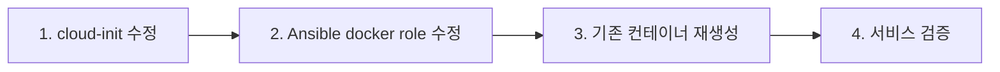

# OpenTofu / Cloud-Init / Ansible 책임 분배 개선

> **Date**: 2026-06-04
> **Status**: Approved
> **Scope**: 레이어 간 중복 제거, 로그 로테이션 추가, 결합점 문서화
> **Verified**: Codex (gpt-5.4-mini) 교차 검증 완료

## 배경

세 레이어(OpenTofu, cloud-init, Ansible)의 책임 분배를 점검. 중복과 결합점을 정리하여 유지보수성 향상.

## 원칙

| 레이어 | 책임 |
|:---|:---|
| **OpenTofu** | 인프라 리소스 생성 (VCN, Instance, Volume) |
| **Cloud-Init** | Ansible 접속을 위한 최소 상태 (SSH + Tailscale up) |
| **Ansible** | 모든 설정 관리의 Source of Truth |

## 개선 사항

### 1. Docker 로그 로테이션 추가

**현재**: 컨테이너 로그가 무제한 증가. 장기 실행 시 디스크 full 가능.

**변경**: Ansible docker role에 `/etc/docker/daemon.json` 배포.

```json
{
  "log-driver": "json-file",
  "log-opts": {
    "max-size": "10m",
    "max-file": "3"
  }
}
```

**적용 파일**: `ansible/roles/docker/tasks/main.yml` — Docker 서비스 시작 전 daemon.json 배포 태스크 추가

**주의 (Codex 검증)**: `daemon.json`의 `log-opts`는 **신규 컨테이너에만** 적용. 기존 컨테이너(code-server, hermes)는 재생성 필요. Ansible docker role에 `docker compose down && up` 단계 추가하거나, ops playbook의 `docker-update` 태그에서 재생성.

### 2. IP forwarding 중복 제거

**현재**: lt의 IP forwarding(sysctl)이 cloud-init과 Ansible 양쪽에서 설정.

**변경**: cloud-init에서 제거. Ansible만 유지.

**제거 파일**: `opentofu/cloud-init-lt.yaml` — 아래 라인 삭제

```yaml
# 제거 대상
- echo 'net.ipv4.ip_forward = 1' | tee -a /etc/sysctl.d/99-tailscale.conf
- echo 'net.ipv6.conf.all.forwarding = 1' | tee -a /etc/sysctl.d/99-tailscale.conf
- sysctl -p /etc/sysctl.d/99-tailscale.conf
```

**유지 파일**: `ansible/roles/tailscale/tasks/main.yml` — sysctl 태스크 (변경 없음)

**근거**: cloud-init의 역할은 "Ansible이 접속할 수 있는 최소 상태". IP forwarding은 설정 관리이므로 Ansible 소관. `tailscale up`은 Ansible 연결성에 필요하므로 cloud-init 유지.

**주의 (Codex 검증)**: cloud-init에서 제거 시 Ansible 실행 전까지 lt는 "Tailscale 접속은 되지만 exit node 라우팅은 불가"한 상태. 가정: `tofu apply` 직후 Ansible을 즉시 실행하므로 영향 시간 최소.

### 3. 결합점 현행화

다음 값들은 여러 파일에서 참조되므로, 변경 시 모든 파일을 동기화해야 한다.

#### 3-1. Block Volume 디바이스 경로

| 값 | `/dev/oracleoci/oraclevdb` |
|:---|:---|
| `opentofu/storage.tf:18` | `device = "/dev/oracleoci/oraclevdb"` |
| `ansible/roles/docker/tasks/main.yml:41` | `dev: /dev/oracleoci/oraclevdb` |
| `ansible/roles/docker/tasks/main.yml:53` | `src: /dev/oracleoci/oraclevdb` |

#### 3-2. code-server 포트

| 값 | `8080` |
|:---|:---|
| `ansible/roles/code-server/templates/docker-compose.yml.j2:9` | `ports: "8080:8080"` |
| `ansible/roles/tailscale/tasks/main.yml:52` | `tailscale serve --bg 8080` |

#### 3-3. Docker 이미지명

| 이미지 | 참조 파일 |
|:---|:---|
| `codercom/code-server:latest` | `ansible/roles/code-server/templates/docker-compose.yml.j2:3`, `ansible/playbook-ops.yml:80` |
| `nousresearch/hermes-agent:latest` | `ansible/roles/hermes/templates/docker-compose.yml.j2:3`, `ansible/playbook-ops.yml:86` |

#### 3-4. Tailscale 호스트명

| 값 | `lt` / `brla` |
|:---|:---|
| `opentofu/variables.tf:28-29` | `amd_hostname`, `arm_hostname` |
| `opentofu/cloud-init-lt.yaml:2` | `hostname: lt` |
| `opentofu/cloud-init-brla.yaml:2` | `hostname: brla` |
| `ansible/playbook-lt.yml` | `hosts: lt` |
| `ansible/playbook-brla.yml` | `hosts: brla` |

#### 3-5. Private Subnet CIDR

| 값 | `10.210.1.0/24` |
|:---|:---|
| `opentofu/variables.tf:29` | `private_subnet_cidr` |
| `opentofu/cloud-init-lt.yaml:11` | `--advertise-routes=${private_subnet_cidr}` |
| `ansible/playbook-lt.yml` | `tailscale_advertise_routes: 10.210.1.0/24` |

#### 3-6. 컨테이너 UID/GID

| 값 | 참조 파일 |
|:---|:---|
| `1001:1001` (code-server) | `ansible/roles/code-server/templates/docker-compose.yml.j2:6`, `ansible/roles/code-server/tasks/main.yml:14-15` |
| `10000:10000` (hermes) | `ansible/roles/hermes/templates/docker-compose.yml.j2` (host network), `ansible/roles/hermes/tasks/main.yml:14-15` |

#### 3-7. 데이터 경로

| 경로 | 참조 파일 |
|:---|:---|
| `/data/code-server/data` | `ansible/roles/code-server/templates/docker-compose.yml.j2:11`, `ansible/roles/code-server/tasks/main.yml` |
| `/data/hermes/data` | `ansible/roles/hermes/templates/docker-compose.yml.j2:9`, `ansible/roles/hermes/tasks/main.yml` |
| `/data/hermes/backup.sh` | `ansible/roles/hermes/templates/backup.sh.j2`, `ansible/roles/hermes/tasks/main.yml:101` |

#### 3-8. Hermes 컨테이너 포트

| 용도 | 포트 | 참조 파일 |
|:---|:---|:---|
| API Gateway | `8642` | `hermes/templates/docker-compose.yml.j2` |
| Dashboard | `9119` | `hermes/templates/docker-compose.yml.j2` |

#### 3-9. Tailscale 네트워크

| 값 | 참조 파일 |
|:---|:---|
| `41641/UDP` | `opentofu/vcn.tf:82-83,106-107` (Security List) |
| `bun-bull.ts.net` | `ansible/roles/tailscale/tasks/main.yml:42-44` (cert 경로) |
| `/var/lib/tailscale/certs/` | `ansible/roles/tailscale/tasks/main.yml:43-46` |
| ProxyJump 패턴 | `opentofu/outputs.tf:23`, `ansible/ssh_config:12` |

#### 3-10. 공통 환경변수

| 값 | 참조 파일 |
|:---|:---|
| `TZ=Asia/Seoul` | `ansible/roles/code-server/templates/docker-compose.yml.j2:14`, `ansible/roles/hermes/templates/docker-compose.yml.j2:11` |

## 배포 순서



인스턴스 destroy 불필요. 다음 Ansible 실행 시 자동 반영:
- `daemon.json` → 새로 배포 → Docker 데몬 재시작
- 기존 컨테이너 → `down && up`으로 재생성 (로그 설정 적용)
- `cloud-init-lt.yaml` → 다음 인스턴스 재생성 시 반영

## 검증

```bash
# Docker 로그 로테이션 (데몬 설정)
ssh brla 'docker info --format "{{.LoggingDriver}}"'
# 기존 컨테이너에 적용되었는지 확인
ssh brla 'docker inspect code-server --format "{{json .HostConfig.LogConfig}}"'
ssh brla 'docker inspect hermes --format "{{json .HostConfig.LogConfig}}"'

# IP forwarding (Ansible로 설정됨)
ssh lt 'sysctl net.ipv4.ip_forward'
```
