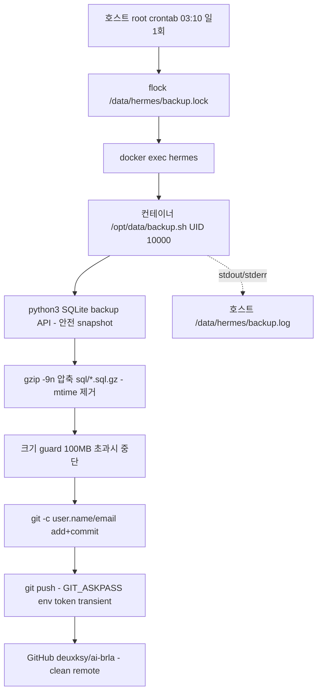
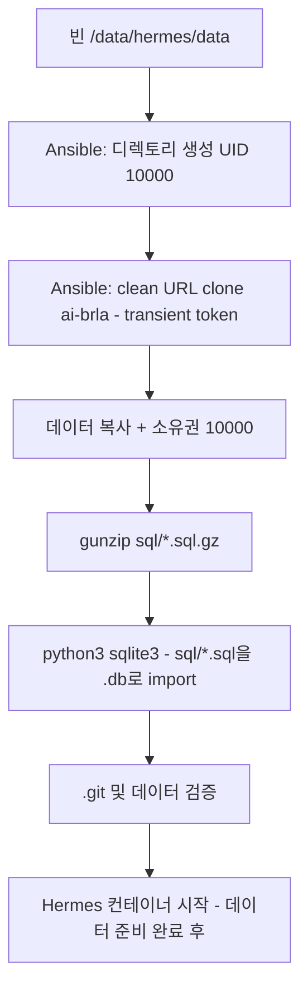

# Hermes 백업 재설계 — Design Spec

> **Date**: 2026-06-28
> **Status**: Draft v2 (Codex 검증 반영)
> **Topic**: Hermes Git 백업의 컨테이너 내부 실행 전환 + 권한 일관성 확보
> **검증**: Codex(gpt-5.5) 단일 — Antigravity quota 초과(429, 14h 후 리셋)로 폴백

## 목차

- [TL;DR](#tldr)
- [문제 정의](#문제-정의)
- [목표](#목표)
- [설계 결정사항](#설계-결정사항)
- [아키텍처](#아키텍처)
- [컴포넌트 변경](#컴포넌트-변경)
- [복원 로직](#복원-로직)
- [데이터 흐름](#데이터-흐름)
- [에러 핸들링 및 신뢰성](#에러-핸들링-및-신뢰성)
- [마이그레이션 계획](#마이그레이션-계획)
- [검증 체크리스트](#검증-체크리스트)
- [결합점](#결합점-동기화-필수)
- [Codex 검증 이력](#codex-검증-이력)

## TL;DR

Hermes 데이터 Git 백업을 **호스트 직접 실행에서 Hermes 컨테이너 내부 실행으로 전환**. 컨테이너 UID를 hermes(10000)로 고정하고, SSH 마운트를 project 내 별도 폴더로 이전해 권한 충돌을 근본 차단. gzip 압축으로 GitHub 100MB 제약 회피.

## 문제 정의

### 1. 백업 push 실패

- `state.db.sql` = **123 MB** → GitHub 100 MB 한도 초과, pre-receive hook 거부
- 로컬이 origin/main보다 **17 커밋 ahead** (최근 4-5일치 백업 누락)
- `.git` = **899 MB** (100 MB+ blob 다수 적재)

### 2. 파일 owner 변질

```
Hermes 컨테이너 실행 UID:  root (0)      ← docker-compose user 지정 없음
/data/hermes/data 소유권:  hermes (10000), mode 0700
```

- Linux는 파일 생성/수정 프로세스의 effective UID를 파일 owner로 기록
- Hermes 컨테이너(root)가 `/opt/data` 파일 조작 → root(0) 소유로 덮어씀
- Ansible이 `owner: 10000`으로 배포해도 컨테이너 실행 후 변질

### 3. 보안

- remote URL에 **GitHub PAT 평문 노출** (`github_pat_...`)

## 목표

1. 백업 push 정상화 (객체 100 MB 이하, **크기 guard로 장기 보장**)
2. 파일 owner 일관성 (항상 hermes/10000, 변질 없음)
3. 호스트 의존성 최소화 (git/python3/gzip 직접 설치 제거)
4. 자원 효율 (sidecar 없이 기존 컨테이너 활용)
5. **복원 신뢰성** (dump → import 라운드트립 검증)
6. **Hermes 런타임 무영향** (SSH/uv/HOME 권한 보존)

## 설계 결정사항

| 항목 | 결정 | 근거 |
| :--- | :--- | :--- |
| 백업 실행 위치 | Hermes 컨테이너 내부 | git/python3/gzip 내장, 호스트 의존성 제거 |
| 컨테이너 UID | `user: "10000:10000"` | 호스트 hermes 계정 일치 → owner 변질 차단 |
| SSH 마운트 | `/data/hermes/ssh`(UID 10000) → `/opt/data/home/.ssh` | ubuntu 홈(0700) 접근 문제 회피, project 내 별도 폴더 |
| 스케줄러 | 호스트 root crontab + `flock` | 가벼움, 동시 실행 방지 |
| 백업 빈도 | 일 1회 (03:10) | `.git` 증가 억제 |
| 압축 | `gzip -9n` (mtime 제거) | blob 안정화, 100MB 이하 |
| LFS | 제외 | 38 MB로 불필요, bandwidth 한도 리스크 |
| Token | docker-compose env, push 시점 transient 사용 | remote URL clean, `.git/config` 잔존 없음 |
| SQLite dump | python3 `backup API`(online backup) | WAL/write 중 정합성 보장 |
| 마이그레이션 | `.git` 재초기화 + force push, archive tag 백업 | 899 MB 단절, remote history 보존 |

## 아키텍처



**권한 모델**:

```
호스트: hermes 계정 (UID 10000, nologin, docker 그룹 아님)
  ├─ /data/hermes/data      (10000 소유, 컨테이너 /opt/data)
  ├─ /data/hermes/ssh       (10000 소유, 0700, 컨테이너 /opt/data/home/.ssh)  ← 신규
  └─ root cron (docker 소켓 접근 가능)
       └─ flock + docker exec hermes → 컨테이너 UID 10000 실행
            └─ 파일 조작 → 항상 hermes(10000) 소유 (변질 없음)
```

## 컴포넌트 변경

### 1. `templates/docker-compose.yml.j2`

```yaml
services:
  hermes:
    user: "10000:10000"           # 신규 — UID 10000 고정
    volumes:
      - /data/hermes/data:/opt/data
      - /data/hermes/ssh:/opt/data/home/.ssh   # 변경 — project 내 별도 폴더
      # /home/ubuntu/.ssh 마운트 제거
    environment:
      - GITHUB_HERMES_TOKEN=...   # 신규 — push용 transient token
```

### 2. `templates/backup.sh.j2` (gzip 추가 완료, 보강)

- `gzip -9n` (mtime 제거 — Codex Risk 반영)
- **SQLite online backup API** 적용 (WAL 안전)
- **크기 guard**: `.sql.gz` 100MB 초과 시 commit 중단
- **git identity 명시**: `git -c user.name=... -c user.email=... commit` (committer)
- **transient token push**: `GIT_ASKPASS` env 스크립트 또는 push URL에만 token, remote는 clean URL
- **ahead 체크**: 변경 없어도 `origin/main` 대비 ahead 시 push 재시도
- 배포 경로: `/data/hermes/data/backup.sh` (컨테이너 `/opt/data/backup.sh`)

### 3. `files/gitignore` (완료)

- `sql/*.sql` 무시, `.sql.gz`만 추적
- `backup.sh` 추가 (백업 repo에서 제외)

### 4. `files/gitattributes` — **삭제** (LFS 제외, repo에서도 즉시 삭제)

### 5. `tasks/main.yml`

- **SSH 폴더 신규 생성**: `/data/hermes/ssh` (UID 10000, 0700), 호스트 `~/.ssh`에서 key 복사 + 소유권 10000
- backup.sh 배포 경로: `/data/hermes/data/backup.sh` (owner 10000)
- cron 재구성: `flock /data/hermes/backup.lock -c 'docker exec hermes /opt/data/backup.sh'`, 일 1회 (`10 3 * * *`)
- **remote clean URL 등록** (token 제거), 복원 clone 시 token은 transient
- 기존 호스트 git_config root global → 백업용은 backup.sh 내 `-c`로 대체
- 컨테이너 UID 10000 전환 task (user 지정)
- **task 순서 변경**: 복원(데이터 + DB import) → 컨테이너 시작
- 마이그레이션은 Ansible에 넣지 않고 brla SSH 수동 실행

## 복원 로직

Codex B2 해결 — `.sql.gz` → `.db` import 라운드트립 필수.

### 복원 시나리오 (신규 인스턴스 재구축)



**핵심**: `.sql.gz`는 텍스트 덤프이므로 `sqlite3 db < dump.sql`로 복원 가능. 이 단계가 누락되면 Hermes가 빈 DB로 기동.

### 복원 검증

- 빈 데이터 디렉토리에서 clone → import → 컨테이너 기동
- dashboard/gateway health + 실제 데이터 조회 확인
- 복원된 `.db` row count가 백업 시점과 일치

## 데이터 흐름

1. **매일 03:10**: 호스트 root cron → `flock` 확보 → `docker exec hermes /opt/data/backup.sh`
2. **컨테이너 (UID 10000)**:
   - SQLite backup API로 online snapshot (WAL 안전)
   - snapshot → SQL dump → `gzip -9n` → `sql/*.sql.gz`
   - **크기 guard**: 각 `.sql.gz` ≤ 100MB 검증
   - `git -c user.name/email commit` → push (transient token)
3. **로그**: stdout/stderr → 호스트 `/data/hermes/backup.log` (cron 리다이렉트)

## 에러 핸들링 및 신뢰성

| 실패 지점 | 동작 | 완화 |
| :--- | :--- | :--- |
| SQLite dump (WAL/write) | backup API로 안전 snapshot | 정합성 보장 |
| gzip 압축 | nonzero exit 중단 | backup.log 기록, 다음 cron 재시도 |
| **크기 100MB 초과** | commit 중단, 경고 로그 | DB 분할 또는 보관 정책 재검토 신호 |
| **disk full** | preflight free space 체크 | raw + gz 동시 존재 공간 확보, atomic rename |
| git push (네트워크/인증) | commit 로컬 유지 | **다음 실행 ahead 체크 후 push 재시도** |
| **cron 동시 실행** | `flock`으로 차단 | 단일 인스턴스 보장 |
| 컨테이너 정지 | docker exec 실패 | restart 정책 + 백업 누락은 로그 감지 |

## 마이그레이션 계획

기존 `.git`(899 MB) 재초기화 — brla SSH 수동 실행 (일회성, 파괴적):

1. **remote history 보존**: `git tag archive/pre-redesign-$(date +%Y%m%d)` 또는 bare mirror 백업
2. **안전망**: `cp -a .git .git.backup-$(date +%Y%m%d)`
3. 기존 raw dump 삭제: `rm -f sql/*.sql`
4. `.git` 삭제 후 재초기화: `git init -b main`
5. remote 재등록 (**clean URL, token 없음**)
6. backup.sh 신규 실행 → gzip dump + 첫 commit
7. `git push -f --force-with-lease origin main` (archive tag로 rollback 경로 확보)
8. **검증**: GitHub repo에 `.sql.gz` 반영, `.git/config`에 token 잔존 없음

> **파괴적**: force push로 origin 히스토리 단절. 백업 repo는 최신 스냅샷이 목적이므로 감수. archive tag + `.git.backup` 이중 안전망.

## 검증 체크리스트

- [ ] docker-compose `user: 10000` 적용 후 Hermes 정상 기동 (dashboard 9120 → 302, gateway 8642 → 200)
- [ ] **UID 10000 런타임 smoke**: `id`, `$HOME`, git/python3/gzip, **SSH 기능**(타 호스트 접속), uv tool install, Discord
- [ ] **SSH 마운트**: `/opt/data/home/.ssh` 접근 가능, key 읽기 권한
- [ ] backup.sh 수동 실행 → `sql/*.sql.gz` 생성, **owner 10000**, **token `.git/config` 잔존 없음**, push 성공
- [ ] **크기 guard**: `.sql.gz` 100MB 이하 확인
- [ ] **gzip -9n**: 동일 데이터 재덤프 시 blob 해시 동일 (mtime 제거 확인)
- [ ] **restore drill**: 빈 데이터 → clone → import → 기동 → 데이터 조회
- [ ] **동시 실행**: backup 2개 병렬 시 flock으로 1개만 실행
- [ ] cron 일 1회 실행 (`10 3 * * *`)
- [ ] `.git` 크기 축소 (899 MB → 수십 MB)
- [ ] **장애 주입**: 컨테이너 restart 중 백업, network 차단, token invalid, disk 부족, 100MB 초과, WAL write 중 dump

## 결합점 (동기화 필수)

| 값 | 참조 위치 |
| :--- | :--- |
| UID `10000` | docker-compose(`user`), 호스트 hermes 계정, `/data/hermes/data`·`/data/hermes/ssh` 소유권, backup.sh 파일 소유권 |
| 데이터 경로 `/data/hermes/data` | docker-compose volume(`/opt/data`), backup.sh, cron |
| **SSH 경로 `/data/hermes/ssh`** | docker-compose volume(`/opt/data/home/.ssh`), Ansible key 복사 task |
| 백업 빈도 `10 3 * * *` | cron, CLAUDE.md |
| 백업 repo `deuxksy/ai-brla` | backup.sh push, 복원 clone, CLAUDE.md |
| Token env `GITHUB_HERMES_TOKEN` | docker-compose env, backup.sh, SOPS(`.env.sops`) |
| 백업 포맷 `sql/*.sql.gz` | backup.sh, gitignore, 복원 import |
| Lock `/data/hermes/backup.lock` | cron flock, backup.sh |

## Codex 검증 이력

**검증 에이전트**: Codex (gpt-5.5, reasoning high) — Antigravity quota 초과(429, 14h 리셋)로 단일 검증

**반영된 Blocker** (6):
1. 경로 충돌 (backup.sh 위치) → design에 경로 이전 명시
2. 복원 import 누락 → 복원 로직 섹션 신설
3. UID 10000 SSH 권한 → SSH 마운트 project 내 별도 폴더로 해결
4. git committer identity → backup.sh `-c user.name/email`
5. PAT 모순 → clean remote + transient token
6. cron 동시 실행 → flock

**반영된 Risk** (7):
- gzip mtime → `gzip -9n`
- 38MB 관측값 → 크기 guard
- live dump 정합성 → SQLite backup API
- disk full → preflight + atomic rename
- push 재시도 → ahead 체크
- gitattributes 잔존 → 즉시 삭제
- force push 안전장치 → archive tag + 이중 백업
